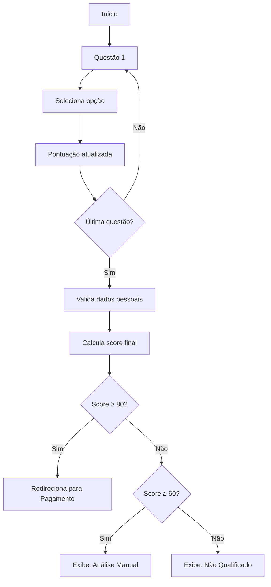

# N.E.R.V.O™ - Neurostructure of Vital Regulation

Sistema avançado de regulação do sistema nervoso aplicado à tomada de decisão estratégica sob pressão contínua, criado exclusivamente para empresários de alto poder e executivos de alto escalão.

---

## 📋 Índice

1. [Visão Geral](#visão-geral)
2. [Estrutura do Projeto](#estrutura-do-projeto)
3. [Tecnologias Utilizadas](#tecnologias-utilizadas)
4. [Páginas e Funcionalidades](#páginas-e-funcionalidades)
5. [Sistema de Qualificação](#sistema-de-qualificação)
6. [Integração de Pagamento](#integração-de-pagamento)
7. [Instalação e Uso](#instalação-e-uso)
8. [Configuração](#configuração)
9. [Customização](#customização)
10. [Suporte](#suporte)

---

## 🎯 Visão Geral

O N.E.R.V.O™ é um método baseado em neurociência aplicada que oferece infraestrutura neurofisiológica para tomadores de decisão que operam sob pressão contínua.

### O que é o N.E.R.V.O™?

- **NÃO É:** Terapia, coaching motivacional, mentoria emocional, grupo de apoio
- **É:** Sistema de regulação neural baseado em neurociência, com foco em:
  - Redução de reatividade
  - Restauração de clareza
  - Sustentação de decisões sob alta pressão
  - Flexibilidade cognitiva

### Público-Alvo

- CEO / Fundador / Sócio
- Diretor / Executivo C-Level
- Empresários com responsabilidade financeira, humana ou estratégica
- Idade: 30-55 anos
- Alta capacidade cognitiva
- Pessoas vistas como "fortes", "resilientes", "referência"

---

## 📁 Estrutura do Projeto

```
nervo-project/
│
├── index.html          # Landing Page + Formulário de Qualificação
├── sales.html          # Página de Vendas (informações completas)
├── pagamento.html      # Página de Pagamento (PIX + Cartão)
├── obrigado.html       # Página de Confirmação Pós-Pagamento
│
├── global.css          # Estilos globais do projeto
├── form.css            # Estilos específicos do formulário
├── form.js             # Lógica do formulário e sistema de pontuação
│
├── README.md           # Este arquivo
└── INTEGRACAO.md       # Guia de integração com APIs
```

---

## 🛠 Tecnologias Utilizadas

### Frontend
- **HTML5** - Semântico e acessível
- **CSS3** - Design system responsivo e moderno
- **JavaScript (ES6+)** - Vanilla JS, sem dependências

### Fontes
- **DM Serif Display** - Títulos e headlines
- **Inter** - Corpo de texto
- **JetBrains Mono** - Elementos técnicos e monospace

### Design
- **Minimalista e Técnico** - Sem elementos motivacionais
- **Paleta Neural** - Tons escuros com acentos em verde (#00E5A0)
- **Tipografia Premium** - Hierarquia clara e legível

### Integrações Previstas
- **InfinitePay** - Gateway de pagamento
- **Email Service** - SendGrid / Mailgun / AWS SES
- **Analytics** - Google Analytics / Plausible

---

## 📄 Páginas e Funcionalidades

### 1. Landing Page (index.html)

**Objetivo:** Apresentar o método e capturar candidatos qualificados

**Seções:**
- Hero com proposta de valor clara
- Problema real no topo da pirâmide
- O que é / O que não é o N.E.R.V.O™
- Para quem é o projeto
- **Formulário de Qualificação Integrado**

**CTA Principal:** "Iniciar Processo de Aplicação"

---

### 2. Página de Vendas (sales.html)

**Objetivo:** Informar sobre o método completo e formato da imersão

**Seções:**
- Posicionamento claro
- O problema real no topo da pirâmide
- Fundamento neurocientífico
- 6 Pilares operacionais do N.E.R.V.O™
- Perfis atendidos
- Formato da Imersão (3 dias)
- Acompanhamento pós-imersão
- Promessa real e verdade central

**CTA Principal:** "Iniciar Processo da Imersão"

---

### 3. Formulário de Qualificação (integrado em index.html)

**Funcionalidades:**
- Progress bar dinâmica
- 10 questões com cards interativos
- Sistema de pontuação em tempo real
- Validação de dados pessoais

**Sistema de Aprovação:**

| Score | Resultado | Ação |
|-------|-----------|------|
| 80-130 | ✅ Aprovado | Redireciona automaticamente para pagamento |
| 60-79 | ⏳ Análise Manual | Exibe mensagem de espera + envia notificação por email |
| 0-59 | ❌ Não Qualificado | Exibe mensagem educada de não adequação |

---

### 4. Página de Pagamento (pagamento.html)

**Objetivo:** Processar pagamento de candidatos aprovados

**Métodos de Pagamento:**
1. **PIX**
   - QR Code gerado dinamicamente
   - Código PIX copiável
   - Confirmação automática via webhook

2. **Cartão de Crédito (InfinitePay)**
   - Parcelamento em até 12x sem juros
   - Formulário seguro
   - Validação em tempo real

**Elementos:**
- Resumo da imersão
- Valor: R$ 12.000
- Garantia de 7 dias
- Mensagem de segurança

---

### 5. Página de Obrigado (obrigado.html)

**Objetivo:** Confirmar inscrição e orientar próximos passos

**Conteúdo:**
- Confirmação visual (✓)
- Personalização com nome do candidato
- 4 próximos passos detalhados:
  1. Confirmação por email
  2. Preparação (documento enviado em 48h)
  3. Contato direto via WhatsApp
  4. Acesso à plataforma (72h antes)
- O que esperar da imersão
- Requisitos técnicos
- Lembrete sobre presença completa
- Contato de suporte

---

## 🎯 Sistema de Qualificação

### Estrutura das Questões

O formulário possui 10 questões divididas em categorias:

#### Questões Eliminatórias (Alto Peso)
1. **Posição atual** (0-20 pontos)
2. **Pessoas sob responsabilidade** (3-15 pontos)
3. **Carga de pressão** (2-15 pontos)

#### Questões Decisivas
4. **Sintomas reconhecidos** (0-15 pontos)
5. **Capacidade de recuperação** (3-12 pontos)
6. **Histórico de desenvolvimento** (3-12 pontos)
7. **Objetivo principal** (3-15 pontos)
8. **Disponibilidade** (2-10 pontos)
9. **Alinhamento de valor** (0-15 pontos)

#### Questão de Dados Pessoais
10. **Nome, Email, Telefone, Empresa** (obrigatório)

### Lógica de Pontuação

```javascript
// Pontuação máxima: 130 pontos

// Exemplo de cálculo:
CEO + 50+ pessoas + Pressão contínua + Múltiplos sintomas + 
Recuperação lenta + Já buscou ajuda + Objetivo clareza + 
Disponibilidade imediata + Valor justo = 118 pontos

// Resultado: APROVADO (≥80)
```

### Fluxo do Formulário



---

## 💳 Integração de Pagamento

### InfinitePay

O projeto está preparado para integração com InfinitePay (gateway brasileiro).

#### Endpoints Necessários

```javascript
// 1. Criar pagamento PIX
POST /v1/payments/pix
{
  "amount": 12000.00,
  "customer": {
    "name": "Nome do Cliente",
    "email": "email@example.com",
    "phone": "11999999999"
  }
}

// Resposta esperada:
{
  "id": "pix_123abc",
  "qr_code": "00020126580014br.gov.bcb.pix...",
  "qr_code_url": "data:image/png;base64,...",
  "status": "pending"
}

// 2. Criar pagamento com Cartão
POST /v1/payments/card
{
  "amount": 12000.00,
  "installments": 12,
  "card": {
    "number": "4111111111111111",
    "exp_month": "12",
    "exp_year": "2028",
    "cvv": "123",
    "holder_name": "NOME NO CARTAO"
  },
  "customer": {
    "name": "Nome do Cliente",
    "email": "email@example.com",
    "cpf": "12345678900"
  }
}

// 3. Webhook para confirmação
POST /webhooks/infinitepay
{
  "event": "payment.approved",
  "payment_id": "pay_123abc",
  "amount": 12000.00,
  "customer_email": "email@example.com"
}
```

#### Implementação no Código

No arquivo `pagamento.html`, você encontrará comentários indicando onde integrar:

```javascript
// TODO: Integrar com InfinitePay API
// Documentação: https://docs.infinitepay.io/

async function processCardPayment() {
  // Coletar dados do formulário
  const paymentData = {
    amount: 12000.00,
    installments: parseInt(document.getElementById('parcelas').value),
    card: { /* dados do cartão */ },
    customer: { /* dados do cliente */ }
  };
  
  // Fazer requisição para sua API backend
  const response = await fetch('/api/payments/card', {
    method: 'POST',
    headers: { 'Content-Type': 'application/json' },
    body: JSON.stringify(paymentData)
  });
  
  const result = await response.json();
  
  if (result.status === 'approved') {
    window.location.href = 'obrigado.html';
  } else {
    // Tratar erro
  }
}
```

---

## 🚀 Instalação e Uso

### Requisitos
- Navegador moderno (Chrome, Firefox, Safari, Edge)
- Servidor web (Apache, Nginx, ou qualquer servidor estático)

### Instalação Local

1. **Clone ou baixe o projeto**
```bash
git clone https://github.com/seu-usuario/nervo-project.git
cd nervo-project
```

2. **Abra com servidor local**

Opção 1 - Python:
```bash
python -m http.server 8000
```

Opção 2 - Node.js:
```bash
npx serve
```

Opção 3 - VS Code Live Server:
- Instale extensão "Live Server"
- Clique direito em `index.html` > "Open with Live Server"

3. **Acesse no navegador**
```
http://localhost:8000
```

### Deploy em Produção

#### Opção 1: Netlify
1. Crie conta em netlify.com
2. Arraste a pasta do projeto para o Netlify
3. Pronto! Seu site está no ar

#### Opção 2: Vercel
```bash
npm i -g vercel
vercel
```

#### Opção 3: GitHub Pages
1. Faça push do código para GitHub
2. Vá em Settings > Pages
3. Selecione branch e pasta
4. Salve

---

## ⚙️ Configuração

### 1. Configurar Emails

Edite `form.js` para configurar envio de emails:

```javascript
// Linha ~280
sendManualReviewEmail(personalData, score) {
  // Integrar com seu serviço de email
  fetch('https://api.seuservico.com/send-email', {
    method: 'POST',
    headers: { 'Content-Type': 'application/json' },
    body: JSON.stringify({
      to: personalData.email,
      subject: 'N.E.R.V.O™ - Análise em Andamento',
      template: 'manual-review',
      data: {
        name: personalData.nome,
        score: score
      }
    })
  });
}
```

### 2. Configurar Analytics

Adicione antes do `</body>` em todas as páginas:

```html
<!-- Google Analytics -->
<script async src="https://www.googletagmanager.com/gtag/js?id=GA_MEASUREMENT_ID"></script>
<script>
  window.dataLayer = window.dataLayer || [];
  function gtag(){dataLayer.push(arguments);}
  gtag('js', new Date());
  gtag('config', 'GA_MEASUREMENT_ID');
</script>
```

### 3. Configurar Webhook do PIX

Crie endpoint no seu backend:

```javascript
// Node.js + Express exemplo
app.post('/webhooks/infinitepay', (req, res) => {
  const { event, payment_id, customer_email } = req.body;
  
  if (event === 'payment.approved') {
    // Enviar email de confirmação
    // Atualizar banco de dados
    // Notificar equipe
  }
  
  res.status(200).json({ received: true });
});
```

---

## 🎨 Customização

### Cores

Edite `global.css` (linhas 7-16):

```css
:root {
  --neural-black: #0A0A0A;
  --accent-primary: #00E5A0;  /* Verde principal */
  --accent-secondary: #00B8D4; /* Azul secundário */
  /* ... */
}
```

### Fontes

Para alterar fontes, edite:

1. Link no `<head>`:
```html
<link href="https://fonts.googleapis.com/css2?family=SuaFonte&display=swap" rel="stylesheet">
```

2. Variáveis no CSS:
```css
:root {
  --font-display: 'SuaFonte', serif;
  --font-body: 'OutraFonte', sans-serif;
}
```

### Valores e Textos

- **Investimento:** Edite em `sales.html`, `pagamento.html` e `obrigado.html`
- **Email de contato:** Procure por "contato@nervoregulacao.com.br"
- **Textos do formulário:** Edite em `index.html` (perguntas e opções)

---

## 📊 Monitoramento

### Métricas Importantes

1. **Taxa de Conversão do Formulário**
   - Iniciaram vs Completaram
   - Taxa de aprovação (≥80 pontos)
   
2. **Taxa de Conversão de Pagamento**
   - Aprovados vs Pagaram
   - Método preferido (PIX vs Cartão)
   
3. **Score Médio**
   - Analisar distribuição de pontos
   - Identificar perguntas mais discriminativas

### Implementar Tracking

Adicione em `form.js`:

```javascript
// Ao submeter formulário
gtag('event', 'form_submission', {
  'event_category': 'Form',
  'event_label': 'Qualification',
  'value': finalScore
});

// Ao aprovar automaticamente
gtag('event', 'auto_approval', {
  'event_category': 'Conversion',
  'event_label': 'Score_Above_80',
  'value': finalScore
});
```

---

## 🆘 Suporte e Troubleshooting

### Problemas Comuns

**1. Formulário não avança**
- Verifique se uma opção foi selecionada
- Abra Console (F12) e veja erros

**2. Score incorreto**
- Verifique `data-score` em cada opção
- Soma máxima deve ser 130 pontos

**3. Pagamento não processa**
- Verifique integração com InfinitePay
- Teste em modo sandbox primeiro

**4. Email não é enviado**
- Configure SMTP corretamente
- Verifique credenciais do serviço

### Logs e Debug

Ative modo debug em `form.js`:

```javascript
const DEBUG_MODE = true;

if (DEBUG_MODE) {
  console.log('Form Data:', formData);
  console.log('Final Score:', finalScore);
}
```

---

## 📝 Checklist de Lançamento

Antes de colocar no ar, verifique:

- [ ] Todos os textos estão corretos
- [ ] Valores de investimento conferidos
- [ ] Emails de contato atualizados
- [ ] Analytics configurado
- [ ] InfinitePay integrado e testado
- [ ] Webhook configurado e testando
- [ ] Emails transacionais testados
- [ ] Formulário testado (todos os cenários)
- [ ] Páginas testadas em mobile
- [ ] Meta tags e SEO configurados
- [ ] Favicon adicionado
- [ ] SSL/HTTPS ativo
- [ ] Política de privacidade adicionada
- [ ] Termos de uso adicionados

---

## 📞 Contato

Para suporte técnico ou dúvidas sobre implementação:

- **Email:** contato@nervoregulacao.com.br
- **Website:** [Em breve]

---

## 📄 Licença

© 2026 N.E.R.V.O™. Todos os direitos reservados.

Este projeto é proprietário e confidencial. Não distribua sem autorização.

---

## 🔄 Versionamento

**Versão 1.0.0** - Lançamento Inicial
- Landing page completa
- Formulário de qualificação com pontuação
- Página de vendas
- Sistema de pagamento (PIX + Cartão)
- Página de confirmação
- Design system completo
- Responsivo para mobile

---

**Desenvolvido com precisão técnica para o N.E.R.V.O™**